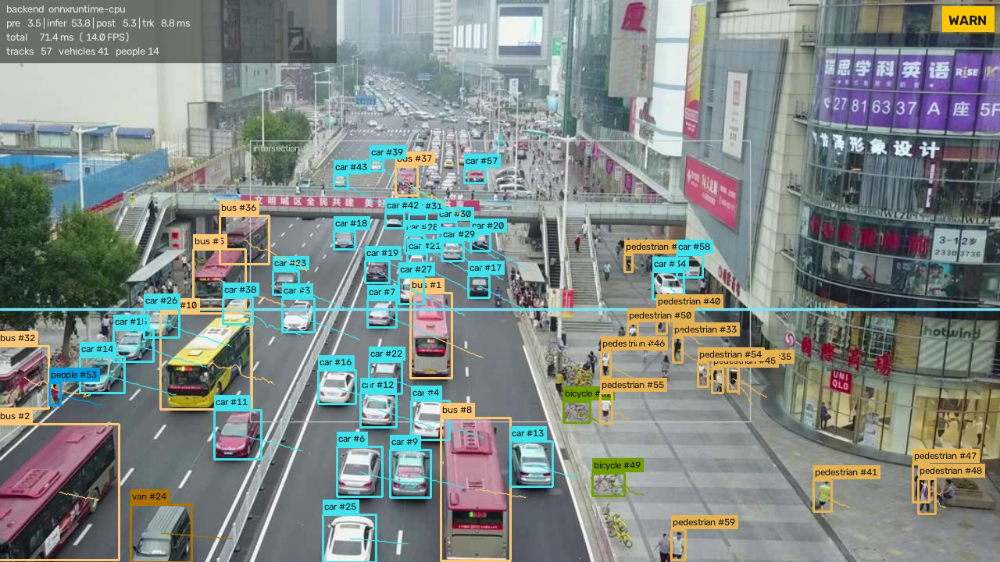
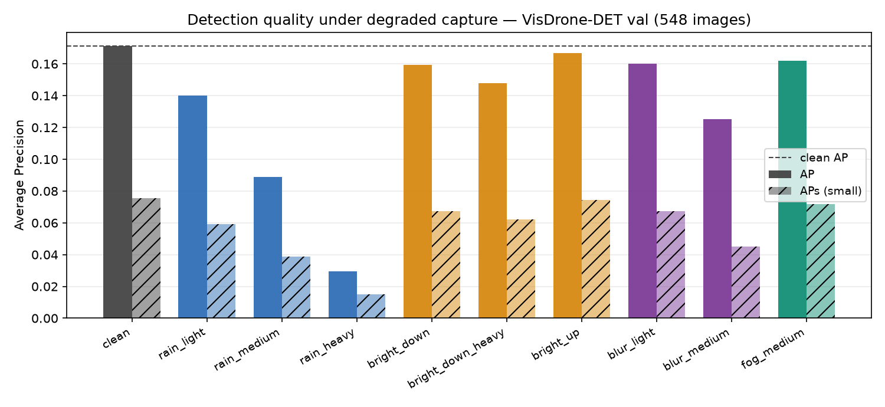

# SkySentry — UAV traffic-order monitoring on a Qualcomm edge NPU

One drone, one edge box, one detector. A UAV surveys a district, a Qualcomm
QCS8550 board processes every frame on-device, and only structured state —
counts, crossings, congestion level — goes back to the command post.

Built for the SOICT Summer School Edge-AI project. The repository contains both
halves of the work: **a deployable product** and **a benchmark that says
honestly how well it runs**.

<p align="center">
  
</p>

---

## Why this rather than a wall of cameras

A fixed-camera deployment needs one device per viewpoint, cabling, and a
permanent install per intersection. One UAV covers a district and moves to
where the problem is. What it cannot do is stream raw 1080p video back over a
flaky radio link — so the intelligence has to sit on the aircraft's companion
board. That is the whole design constraint, and it is why every number in this
repository is measured on the device rather than on a laptop.

## What it does

| VisDrone task | Implemented as | Where |
|---|---|---|
| Task 1 — detection in images | YOLOv8n fine-tuned on VisDrone, 10 classes | `3-pipeline/detector.py` |
| Task 2 — detection in video | the same detector driven frame-by-frame | `3-pipeline/run_pipeline.py` |
| Task 4 — multi-object tracking | ByteTrack + Kalman, dependency-free | `3-pipeline/tracker.py` |
| Task 5 — crowd / vehicle counting | per-frame, per-ROI, per-class counting | `3-pipeline/analytics.py` |

The device pipeline above is the deployable half, and it is what this branch
carries. The experimental half — benchmarks, quantization, degradations, GPU
renders — lives on the `research` branch; see
[Repository layout](#repository-layout).

> **Commands below that begin with `1-model/`, `2-augment/`, `4-bench/`,
> `6-showcase/` or `notebooks/` need that branch:** `git checkout research`.
> The results they produced are quoted here because they are what the claims
> rest on, but the code that produced them is not in this tree.

On top of the tasks: directional line-crossing counts, a congestion level with
hysteresis, an offline-first telemetry store, and a command-post dashboard.

## What it measures

The benchmark is not an afterthought — it is the part that makes the product
claim believable.

- **Latency split, never a single number.** `pre` / `infer` / `post` / `track`
  are reported separately. A detector with a 3 ms forward pass and a 15 ms NMS
  tail is not a 3 ms detector.
- **Robustness under degraded capture.** Ten conditions — rain (light/medium/
  heavy), brightness up/down, motion blur, fog — seeded per image index, so
  the degraded set is reproducible run to run (bit-exact on a given OpenCV
  build; deterministic but not bit-exact across builds). See `2-augment/`.
- **Resource cost.** Thermal, CPU/GPU frequency and any power rail the board
  actually exposes. If the board has no energy counter, the tool says so
  instead of reporting a zero. See `4-bench/probe_power.py`.

### Results — VisDrone-DET val, 548 images, all ten conditions

The detector was fine-tuned on clean imagery only. That is the point of the
table: it measures what a conventionally-trained model does when it actually
has to fly.

| condition | AP kept | APs kept | | condition | AP kept | APs kept |
|---|---:|---:|---|---|---:|---:|
| `bright_up` | 97 % | 99 % | | `rain_light` | 82 % | 78 % |
| `fog_medium` | 94 % | 95 % | | `blur_medium` | 73 % | **60 %** |
| `bright_down` | 93 % | 89 % | | `rain_medium` | 52 % | 51 % |
| `blur_light` | 93 % | 89 % | | `rain_heavy` | **17 %** | 20 % |
| `bright_down_heavy` | 86 % | 82 % | | | | |

Three findings, all of which contradict the obvious expectation:

**Only rain actually breaks it.** Every other condition stays above 73 %.
A clean-trained model turns out to be far more robust to exposure — the thing
augmentation recipes emphasise — than to precipitation, which they usually omit.
If you can only augment one thing, augment rain.

**Blur is what destroys small objects.** `blur_medium` keeps 73 % of AP but only
60 % of APs. At 640 input, a 20-pixel object under a 9-pixel kernel is gone.
69 % of objects in this split are small, so the headline AP understates it.

**The latency penalty flips sign with the confidence threshold.** At the AP
protocol (`conf 0.001`) rain raises CPU postprocessing 85 %, because streaks
manufacture candidates that clear the threshold. At the deployment threshold
(`conf 0.25`) the same rain *lowers* NMS cost 44 % and drops detections to
46.6 % — the pipeline gets faster because it sees less. Operationally that is
the worse of the two: latency telemetry looks healthy exactly when the
detector is going blind. See [`docs/BENCHMARK.md`](docs/BENCHMARK.md) and the
per-frame record in [`docs/results/compare_rain_heavy.csv`](docs/results/compare_rain_heavy.csv).

<p align="center">
  
</p>

---

## On the silicon

Everything in this section was executed on a physical QCS8550 (`product:kalama`,
Android 13, QNN v2.45) or on Qualcomm AI Hub. Each table says which, because
the two disagree and the disagreement is itself a result.

### The fastest precision is the one that does not work

Post-training quantization through AI Hub, profiled on QCS8550:

| precision | inference | vs fp16 | ops on NPU | fallback | usable |
|---|---:|---:|---|---:|---|
| fp16 | 5.087 ms | 1.00× | 246 / 246 | **0** | ✅ |
| **w8a16** | **3.977 ms** | **1.28×** | 248 / 248 | **0** | ✅ |
| w8a8 | **1.993 ms** | **2.55×** | 248 / 248 | **0** | ❌ |

Zero operator fallback in every configuration — the whole graph lands on the
Hexagon, which is the thing a FLOPs table can never tell you.

Then the accuracy check inverts the table. **w8a8 produces zero detections.**
Not fewer — none. The failure is specific and therefore diagnosable: box
regression survives quantization intact while the classification branch
collapses to exactly zero. Per-tensor int8 fits one scale to a sigmoid output
that is near-zero almost everywhere with a handful of sharp peaks, and the
peaks do not survive it.

Confirmed on our own board, not just on Qualcomm's: over 200 validation images
the device emitted **16,800,000 class scores and every one is exactly 0.0**,
while the box channels of the same tensors carry normal values.

So the deployable speedup is **1.28×**, not the 2.55× the w8a8 row advertises.
A quantization table that reports latency without checking that the model still
detects anything recommends exactly the wrong configuration.

### AP measured on the Hexagon, not simulated

The board has no Python and cannot letterbox. For an offline split it does not
need to: 200 val images were preprocessed once on the host, pushed as raw
tensors, executed on the NPU, and the head outputs scored with the same
decoder, NMS and AP code as every other row.

| | AP | AP50 | APs |
|---|---:|---:|---:|
| host fp32 (ONNX Runtime) | 0.1647 | 0.2970 | 0.0902 |
| **board fp16 (Hexagon)** | **0.1631** | **0.2947** | **0.0889** |
| Δ | −0.98 % | −0.76 % | −1.44 % |
| board w8a8 | 0.0000 | 0.0000 | 0.0000 |

Within 1 % of the host figure, so the ten-condition robustness tables can be
quoted as representative of the device rather than as a simulation of it.

### Quantization costs more in the rain — and only in the rain

Every published quantization table measures accuracy loss on clean imagery. A
drone does not fly in clean imagery. Running the same ten-condition protocol on
the w8a16 model and differencing against fp32:

| condition | quantization cost (AP) | (APs) |
|---|---:|---:|
| `clean` | −1.8 % | −3.4 % |
| **`rain_heavy`** | **−7.1 %** | **−10.1 %** |
| `bright_up` | −2.3 % | −3.6 % |
| **`blur_medium`** | −1.4 % | **−0.7 %** |

The clean number understates heavy rain by **3.9×**. And the amplification is
specific to rain: exposure sits at the clean cost, and blur is *below* it.
A mechanism that fits all three — rain *adds* high-frequency structure, which
manufactures detections near the confidence boundary, and quantization noise
flips exactly those; blur *removes* it, leaving fewer marginal candidates to
disturb.

### The same binaries are 8× slower on our board than on AI Hub's

| | AI Hub `QCS8550 (Proxy)` | our board | ratio |
|---|---:|---:|---:|
| fp16 | 5.087 ms | **39.84 ms** | 7.8× |
| w8a8 | 1.993 ms | 21.18 ms | 10.6× |

Four explanations were tested and eliminated: thermal (NSP at 33.7 °C), CPU
contention (95 % idle), NPU clock policy (flat across five `perf_profile`
settings) and host-side dtype conversion (`--use_native_input_files` unchanged).
What survives is the harness — AI Hub reports the backend's graph-execute time,
while `qnn-net-run` marshals tensors across the CPU↔DSP boundary every
iteration. Stated as the surviving hypothesis, not a proven one.

**For the frame budget, 39.84 ms is the number to plan against**, and 5.087 ms
is the ceiling a zero-copy integration would be chasing.

Full protocol and job IDs: [`docs/QUANTIZATION.md`](docs/QUANTIZATION.md).

---

## Tiled inference: +69.8 % on small objects

A 1920×1080 frame letterboxed to 640 is scaled by 0.33, and mosaic augmentation
halves it again during training — a 15 px pedestrian reaches the network at
**2.5 px**, below what a stride-8 feature map can represent at all. Those labels
ask for something the architecture cannot express, and no amount of extra
training changes it.

Cutting the frame 2×2 with 20 % overlap gives 1067×600 tiles that letterbox at
0.60, so every object arrives **1.80× larger** regardless of its size.

| | AP | AP50 | **APs** | ms/img |
|---|---:|---:|---:|---:|
| untiled | 0.2112 | 0.3372 | 0.0612 | 62.8 |
| **tiled 2×2, overlap 0.20** | **0.2468** | **0.3943** | **0.1038** | 248.4 |
| | **+16.8 %** | +16.9 % | **+69.8 %** | **3.95×** |

**The gain concentrates in APs, which is what makes it believable.** The claimed
mechanism is "small objects arrive larger", and small objects are where nearly
all of it lands. A uniform improvement across all sizes would have meant
something else was responsible.

Merging the tiles is where this goes wrong quietly. A car bisected by a tile
edge yields a confident half-car box whose IoU against the whole-car box from
the neighbouring tile is around 0.5 — below any usable NMS threshold, so it
survives as a duplicate. Dropping detections that touch an *interior* tile edge
(the image border is exempt) is worth **+3.4 % AP and +8.5 % APs** on its own
and removes 22.6 duplicate detections per image.

[`docs/TILING.md`](docs/TILING.md) · [`3-pipeline/tiled_detector.py`](3-pipeline/tiled_detector.py)

---

## Repository layout

The directory names are the pipeline. This branch carries the deployable half
only — what is needed to run the demo on the board and watch it from a
dashboard:

```
run_demo.py   the one entry point: --version sample | realtime
0-setup/      find the board, deploy to it, probe its capabilities
3-pipeline/   detector -> tracker -> analytics -> telemetry -> overlay
              + tiled_detector.py: overlapping-crop inference and merge
5-server/     command post: ingest API + dashboard
configs/      every value that changes a reported number
models/       per-model summary.json / export.json / args.yaml / results.csv
              (weights are 10 MB each and are not in git — see below)
scripts/      dataset fetch, demo clip synthesis
```

### The `research` branch

The experimental half is on `research` and is kept out of this tree on
purpose: it is large, it is not needed to run anything, and mixing it in makes
the deployable code harder to read.

```
1-model/          export to ONNX, build the PTQ calibration set
2-augment/        deterministic weather / exposure / blur degradations
4-bench/          latency ladder, robustness table, tiling A/B, MOT scoring
6-showcase/       GPU renders of the three video tasks
configs/trackers/ one-change-per-file BoT-SORT / OC-SORT ablations
notebooks/        Colab: weather finetune, 4-architecture two-stage study
```

```bash
git checkout research            # everything above
git checkout research -- 4-bench # or just one layer, into this tree
```

Weights are in neither branch. `.pt` and `.onnx` run 5–17 MB apiece and are
reproducible from the training notebook, so committing them would have added
121 MB of binaries that no diff can review. What *is* committed is each
model's `summary.json`, `export.json`, `args.yaml` and `results.csv` — about
10 KB per model, and the part the numbers in this README rest on.

```bash
python run_demo.py --list        # which models are on this machine, with mAP
```

Documents, in the order they became true:

| | |
|---|---|
| [`docs/BENCHMARK.md`](docs/BENCHMARK.md) | protocol: what each column means and why |
| [`docs/QUANTIZATION.md`](docs/QUANTIZATION.md) | fp16 / w8a16 / w8a8 on QCS8550, with job IDs |
| [`docs/TILING.md`](docs/TILING.md) | overlapping crops, measured rather than argued |
| [`docs/RUNBOOK.md`](docs/RUNBOOK.md) | board bring-up, written from the failures we hit |
| [`docs/PLAN_REVIEW.md`](docs/PLAN_REVIEW.md) | which experiments were worth running |
| [`docs/results/`](docs/results/) | every CSV behind every table above |

## Showcase renders — Tasks 2 / 4 / 5

`3-pipeline/` is written for an aarch64 board with no torch. `6-showcase/` is
the opposite constraint: an x86 host with an NVIDIA GPU, where the goal is a
presentable render of real footage rather than a defensible latency number.

```bash
uv python install 3.12
uv sync                                   # torch comes from the cu128 index
uv run python 6-showcase/render_all.py --h264
```

Drop a clip into `video/` and each renderer writes three files:

| | |
|---|---|
| `results/taskN_*.mp4` | source resolution, annotated, with a **temporary** readout burned in |
| `results/taskN_*.csv` | one row per frame — Task 5 uses the same schema as the device telemetry |
| `results/taskN_*.json` | the same rows plus `meta` (model hash, engine, imgsz, thresholds) and the class palette |

The readout block is scaffolding, not the product — the dashboard is a web app
that reads the JSON. `--no-stats` turns it off; nothing is lost, because
everything on screen is also in the record.

```bash
# fast iteration: 10 seconds, one task
uv run python 6-showcase/render_detection.py --start 0 --duration 10

# what does the GPU actually do — 200 frames, no video written
uv run python 6-showcase/render_detection.py --benchmark 200

# board-parity comparison: the frozen ONNX graph on the CPU
uv run python 6-showcase/render_detection.py --engine onnx --device cpu
```

### Camera motion is compensated, and it changes the answer

The footage is shot from a moving UAV. Measured over 400 frames the camera
translates a mean of **4.9 px/frame**, p95 **18.6 px**, ~1957 px cumulative —
most of the frame width. Left uncorrected that is not noise, it is a wrong
answer that looks right:

- a **parked** car sweeps across a screen-fixed counting line and is counted as
  traffic
- trails get drawn on stationary vehicles, which reads as tracker failure
- ByteTrack matches a Kalman prediction to a detection by IoU, and at 18–22 px
  of camera motion a small object's predicted and observed boxes barely overlap,
  so the identity is dropped and re-created

`6-showcase/gmc.py` estimates one similarity transform per frame with sparse
optical flow (`goodFeaturesToTrack` + `calcOpticalFlowPyrLK` +
`estimateAffinePartial2D` under RANSAC, ~2.7 ms at quarter scale) and applies it
to the Kalman state, the trails and the density accumulator. A track then counts
as *moving* on its compensated velocity alone.

Over the full 1560-frame clip the correction removes half the crossings:

| `main_road` | forward | backward |
|---|---:|---:|
| screen-fixed line, uncompensated | 56 | 10 |
| **moving objects only** | **27** | **8** |

6.6 of 15.6 tracks per frame are actually moving; the rest is a market full of
parked vehicles that the drone flies over. Both figures are written to the CSV
(`line_*` and `xmov_*`) so the correction can be shown rather than asserted.
`--no-gmc` turns it off.

### Why 640 and not 1280

The `.pt` runs under torch, which takes a dynamic input shape, so `--imgsz` is a
real knob here — unlike the ONNX path, whose graph is frozen at 640×640. The
obvious move was to raise it and recover small objects. Measured on this clip it
does not work:

| imgsz | det/frame @ conf 0.25 | det/frame @ conf 0.10 | model ms |
|---|---:|---:|---:|
| **640** | **17.8** | 17.7 | **6.3** |
| 1280 | 17.1 | 20.8 | 12.6 |
| 1600 | 17.1 | — | 18.3 |

640 is where the model was fine-tuned, on VisDrone stills that were themselves
letterboxed down to it. Running at 1280 presents objects at roughly twice the
pixel size it learned, which moves the input *away* from the training
distribution rather than revealing more of it. So 640 is the default: three
times faster, no fewer detections, and comparable to `docs/RESULTS.md`.

## Quick start

### Host

```bash
python -m venv .venv && .venv/Scripts/activate      # Linux: source .venv/bin/activate
pip install -r requirements-host.txt

# 1. get the validation split (548 images, ~78 MB)
python scripts/fetch_data.py

# 2. export your fine-tuned checkpoint
python 1-model/export_onnx.py --weights models/yolov8n_visdrone.pt \
    --imgsz 640 --out models/yolov8n_visdrone_640.onnx

# 3. make a demo clip and run the whole pipeline over it
python scripts/make_clip.py --seconds 20
python 3-pipeline/run_pipeline.py --source assets/demo_clip.mp4 \
    --save-video results/demo.mp4 --headless
```

### Command post

```bash
python 5-server/app.py --port 8000        # dashboard at http://localhost:8000
```

### Board

```powershell
.\0-setup\find_device.ps1                 # locate it over SSH or adb
.\0-setup\deploy.ps1 -DeviceIp 192.168.1.77
```

```bash
ssh root@192.168.1.77                     # password on the stock image: oelinux123
cd /opt/skysentry && bash device_setup.sh

python3 4-bench/bench_latency.py --model models/yolov8n_visdrone_640.onnx --iters 50
python3 3-pipeline/run_pipeline.py --source 0 --headless \
    --post-url http://<laptop-ip>:8000/ingest
```

## Benchmarks

```bash
# latency ladder — needs no trained weights, run it the moment the board is up
python 4-bench/bench_latency.py --model models/yolov8n_visdrone_640.onnx

# full robustness table: 10 conditions over 548 images
python 4-bench/bench_quality.py --model models/yolov8n_visdrone_640.onnx \
    --all-conditions --out results/quality_mask.csv

# tables + figures
python 4-bench/report.py --quality results/quality_mask.csv \
    --latency results/latency.csv --out results/report

# side-by-side demo video: same model, clean vs degraded
python scripts/make_comparison_video.py --condition rain_heavy \
    --out results/compare_rain_heavy.mp4
```

The NMS tail, measured at four candidate loads on the host CPU — this is the
cost that a FLOPs table never shows:

| surviving candidates | 50 | 150 | 300 | 600 |
|---|---:|---:|---:|---:|
| `post_ms` | 1.92 | 4.21 | 9.01 | 19.82 |

Slightly superlinear, and VisDrone val averages 70.7 annotated objects per
image with the busiest frames well past 300.

### Closing the loop

The table says rain is the failure. [`1-model/finetune_weather.py`](1-model/finetune_weather.py)
is the intervention: it injects the *same* degradation functions the benchmark
uses as a training-time callback, so the training and evaluation distributions
come from identical code and an improvement cannot be an artefact of two
different rain models.

**Colab, end to end** — [`notebooks/finetune_weather_colab.ipynb`](notebooks/finetune_weather_colab.ipynb)
([open in Colab](https://colab.research.google.com/github/HohoHocCode/edge-uav-traffic/blob/main/notebooks/finetune_weather_colab.ipynb)):
fetches VisDrone, builds the augmented set, fine-tunes, exports ONNX and
re-measures on the identical protocol.

**Or build the dataset offline for any trainer:**

```bash
python 2-augment/build_dataset.py --train data/VisDrone2019-DET-train \
    --val data/VisDrone2019-DET-val --out /path/to/out \
    --mode pair --max-side 1024 \
    --conditions rain_light:0.34 rain_medium:0.34 bright_down:0.16 blur_light:0.16
```

`rain_heavy`, `bright_down_heavy`, `blur_medium` and `fog_medium` are held out
of training on purpose. Training on the condition you then report turns the
improvement into recall of the test; holding them out makes four of the ten
benchmark columns a generalisation result instead. The headline number comes
out lower and means considerably more.

Every benchmark row carries the model hash, the backend, the resolution, the
condition id and the ignore-region policy. A number without those cannot be
compared to anything, so the tooling refuses to emit one.

See [`docs/BENCHMARK.md`](docs/BENCHMARK.md) for the protocol and
[`docs/RUNBOOK.md`](docs/RUNBOOK.md) for device bring-up including the failure
modes we actually hit.

## Limitations

Stated up front, because a benchmark that hides these is not worth reading.

- Evaluation is on **VisDrone-DET val, 548 images, 10 classes**. Absolute AP is
  not directly comparable to the official VisDrone leaderboard; the ignore-region
  policy is reported per row so the convention is at least explicit.
- The demo clip is synthesised by flying a virtual camera over VisDrone stills.
  Object motion within the scene is real; **camera motion is not**. No tracking
  accuracy claim is made from it.
- Only one detector family is benchmarked end-to-end (YOLOv8n). A four-way
  comparison (v8n / v11n / v26n / v26n-p2) is set up in
  [`notebooks/finetune_1model_colab.ipynb`](notebooks/finetune_1model_colab.ipynb)
  but is not reported here yet.
- **Provenance differs per table and is labelled per table.** Three places
  produce numbers in this repository and they are not interchangeable:
  Qualcomm AI Hub's `QCS8550 (Proxy)` (real V73 silicon in a cloud device farm,
  but not our board), our physical QCS8550, and the host CPU. An earlier
  revision of this README claimed every number was a CPU number; that is no
  longer true, and the `measured_by` column in `docs/results/*.csv` is
  authoritative.
- **The host-simulated accuracy tables are validated, not assumed.** fp16 on
  the real Hexagon lands within 1 % of the host figure on the same 200 images,
  which is why the ten-condition sweep is quoted as representative rather than
  re-run on-device for each condition.
- **YOLO26 output is not backward compatible.** `yolo26n` and `yolo26n-p2` are
  NMS-free and emit `(1, N, 6)` — already-decoded boxes — where v8/v11 emit
  `(1, 4+nc, anchors)`. `3-pipeline/detector.py` decodes only the latter, so a
  v26 model plugged in today fails silently rather than loudly. Each export
  records its real output shape and a `pipeline_compatible` flag.
- **Tiled inference has not been measured on the board.** At the harness figure
  of 39.84 ms per forward pass, four tiles is ~159 ms of NPU time per frame
  before preprocessing and merging — roughly 5 FPS. A zero-copy integration
  would put the ceiling near 18 FPS. Neither has been measured end-to-end on
  the device.
- **The congestion monitor inherits the detector's blindness.** In heavy rain
  the vehicle count falls because detection fails, not because traffic
  cleared, and the dashboard will report "normal" with healthy-looking
  latency. Nothing in the current pipeline distinguishes an empty road from a
  road it cannot see. A deployment would need a capture-quality signal
  independent of the detector before this alert could be trusted.

## License

AGPL-3.0 — see [LICENSE](LICENSE). The detector is derived from
[Ultralytics YOLOv8](https://github.com/ultralytics/ultralytics), which is
AGPL-3.0; a combined work distributed or served over a network must publish its
source under the same terms. This repository is public for exactly that reason.

## Acknowledgements

- VisDrone benchmark — Zhu et al., Tianjin University
- Ultralytics YOLOv8
- ByteTrack — Zhang et al., 2022
- Qualcomm AI Hub / QAIRT tooling, and the SOICT Summer School organisers for
  the hardware
