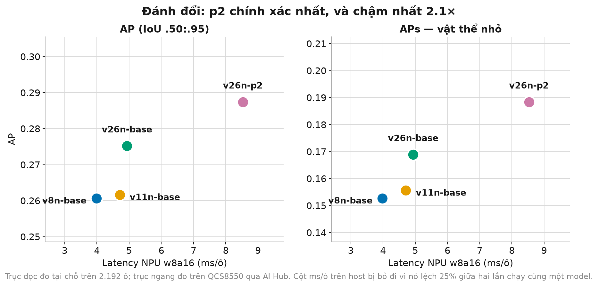

# Edge benchmark — QCS8550

Latency, memory, throughput, parameters, thermals and energy for four detector
architectures, measured in three places that are not interchangeable.

**Read the provenance column before quoting any number.** Numbers here come
from Qualcomm AI Hub's cloud device, from the physical board on the desk, and
from a host laptop. The three disagree, and where they do the disagreement is
recorded rather than averaged away.

| Where | What it is | Used for |
|---|---|---|
| **AI Hub `QCS8550 (Proxy)`** | Real Hexagon V73 silicon in Qualcomm's device farm. Not our board. | NPU latency, op residency, peak memory |
| **Lab board** | `qrobot@kalama`, Ubuntu 22.04, QIRP SDK 2.28, Kryo CPU + Hexagon V73 | CPU-side cost, thermals, clocks, power probe |
| **Host** | This laptop, ONNX Runtime CPU | AP on the tiled split, quantized-output checks |

---

## 1. The models

Four architectures, each trained on the same tiled VisDrone-DET split with the
same batch (32), seed (0), epochs (30, or 45 for p2) and no frozen layers.

| model | params | GFLOPs | stride | anchors @640 | ONNX fp32 | w8a16 ctx | compression |
|---|---:|---:|---|---:|---:|---:|---:|
| v8n-base | 3.157 M | 8.86 | 8/16/32 | 8 400 | 12.27 MB | 3.67 MB | 3.34× |
| v11n-base | 2.624 M | 6.67 | 8/16/32 | 8 400 | 10.61 MB | 3.44 MB | 3.09× |
| v26n-base | 2.572 M | 6.24 | 8/16/32 | 8 400 | 9.81 MB | 3.38 MB | 2.90× |
| v26n-p2 | 2.662 M | 9.65 | **4**/8/16/32 | **34 000** | 10.46 MB | 3.39 MB | 3.09× |

p2 carries the fewest-but-one parameters and the *most* compute: the stride-4
branch runs at 160×160, so it costs 1.5× the GFLOPs of v26n-base for 3.5% more
weights. Parameter count and compute are not the same axis, and on an NPU the
one that matters is usually neither — see §4.

`docs/results/model_specs.csv`

---

## 2. Accuracy — one split, one decoder, one AP implementation

Each model had reported its own mAP from its own Colab tab. Those are only
comparable if nothing but the architecture differed, which had already failed
twice here, so every model was re-scored locally on one tiled split.

548 val images → 2 192 tiles (2×2, 20% overlap), conf 0.001, IoU 0.65,
maxDets 500, ignore regions cut to the tile and masked.

| model | AP | AP50 | AP75 | APs | APm |
|---|---:|---:|---:|---:|---:|
| **v26n-p2** | **0.2874** | **0.4766** | **0.2925** | **0.1884** | **0.3750** |
| v26n-base | 0.2752 | 0.4631 | 0.2763 | 0.1689 | 0.3713 |
| v11n-base | 0.2616 | 0.4381 | 0.2627 | 0.1556 | 0.3667 |
| v8n-base | 0.2606 | 0.4405 | 0.2597 | 0.1527 | 0.3702 |

**p2 wins every column**, and by the largest margin on APs: +23.4% over v8n
against +10.3% on AP overall. The stride-4 branch does what it exists to do,
and the gap widens exactly where it should — a result that lands on the metric
the mechanism predicts is worth more than a result that lands everywhere.

**v8n and v11n are not distinguishable.** They differ by 0.001 AP, and the
order is *reversed* against the figures their own Colab runs reported (0.2724
vs 0.2715 there). A difference that flips when you re-measure it is not a
difference.

Host `ms/tile` is deliberately absent from this table. It is in the CSV, and it
moved 25% between two runs of the same model on the same machine (v26n-base
52.2 → 39.1), so it cannot carry a latency claim. Latency comes from §4.

`docs/results/tiled_val_4models.csv`



---

## 3. Tiling

A 1920×1080 frame letterboxed to 640 is scaled by 0.33, and mosaic halves it
again during training, so a 15 px pedestrian reaches the network at 2.5 px —
below what a stride-8 map can represent. Cutting 2×2 with 20% overlap gives
1067×600 tiles that letterbox at 0.60, so every object arrives **1.80× larger**.

| | AP | AP50 | APs | ms/img |
|---|---:|---:|---:|---:|
| untiled | 0.2112 | 0.3372 | 0.0612 | 62.8 |
| **tiled 2×2, ov 0.20** | **0.2468** | **0.3943** | **0.1038** | 248.4 |
| | +16.8% | +16.9% | **+69.8%** | 3.95× |

The gain concentrates in APs, which is what makes the mechanism credible rather
than merely the outcome favourable. Details and the merge rules in
[`TILING.md`](TILING.md).

---

## 4. Quantization on the NPU

Four precisions per model, each profiled on QCS8550 and then checked for
whether it still detects anything. **Zero operator fallback in every
configuration**, including the end-to-end head with its TopK — residency was
never the constraint.

### Latency (ms), AI Hub on QCS8550

| | v8n | v11n | v26n e2e | v26n no-e2e | v26n-p2 no-e2e |
|---|---:|---:|---:|---:|---:|
| w8a8 | 1.992 | 2.315 | 2.525 | 2.439 | 4.288 |
| **w8a16** | **3.984** | **4.710** | 6.732 | **4.935** | **8.531** |
| w16a16 | 4.263 | 4.955 | 6.942 | — | — |
| w4a16 | 4.062 | 6.319 | 7.644 | — | — |

### Which of those actually work

| | w8a8 | w8a16 | w16a16 | w4a16 |
|---|---|---|---|---|
| v8n | ✗ conf→0 | ✓ 233 boxes | ✓ 233 | ⚠ 120/164 |
| v11n | ✗ conf→0 | ✓ 237 | ✓ 246 | ⚠ 29/52 |
| v26n **end2end** | ✗ conf→0 | ✗ **box→point** | ✗ box→point | ✗ box→point |
| v26n no-e2e | ✗ conf→0 | ✓ 260 | — | — |
| v26n-p2 no-e2e | ✗ conf→0 | ✓ 354 | — | — |

**Eight of sixteen quantized configurations are unusable, and every one of them
reports good latency.**

**w8a8 collapses the classification head on all five** model/export
combinations — every class score exactly 0.0 while box regression stays
healthy. Five for five, across three architectures and both export modes, is
what makes this a property of the detect head rather than of any one model.
Per-tensor int8 fits one scale to a sigmoid that is near-zero almost everywhere
with a handful of sharp peaks, and the peaks do not survive it.

**p2 is the slowest quantized model by a wide margin** — 8.531 ms against v8n's
3.984 — because its stride-4 branch quadruples the anchor count to 34 000. Its
parameter count (2.662 M, second smallest) predicts the opposite of its latency
ranking, which is the same lesson as §1 seen from the other end.

**w4a16 degrades without failing, which is worse.** v11n keeps 29 valid boxes
against fp32's 244, confidence correlation falls to 0.726, and mean box size
shrinks from 26×21 to 15×13. It is also *slower* than w16a16 (6.319 vs 4.955 ms
on v11n): int4 weights are unpacked before use and the HTP has no path for
them. More compression buys size, not speed.

**w8a16 ≈ w16a16 in time but half the size**, within 3–7% across all models.
Activation width sets the price; weight width does not. w16a16 has no reason to
exist here.

### YOLO26 must not be exported end2end

| export | w8a8 | w8a16 |
|---|---|---|
| end2end (decode **in** graph) | conf→0 | **box→point** |
| no end2end (decode **outside**) | conf→0 | **works** |

Same weights, same calibration, same precision — only where the decode lives.

Removing NMS means the box decode moves inside the graph: anchor-grid offsets
spanning 0–640 added to regressed distances. That sum needs more dynamic range
than one int16 scale holds, so boxes collapse to a single point while
confidence still tracks fp32 at **0.9995** — no ordinary metric catches it.
v8n/v11n decode in postprocess, so only raw regression values are quantized,
which is why w8a16 works there.

Qualcomm's own wrapper does the same thing: `boxes, scores = self.model(image)`
concatenated to `[batch, 4+nc, preds]`, decoded outside. Disabling `end2end`
before export restores it — 260 detections, 260 valid boxes, mean size matching
fp32 to one decimal.

`docs/results/quant_matrix_all.csv`

---

## 5. The CPU side, measured on the board

The NPU number is not the frame budget. Letterboxing, colour conversion, the
float cast and NMS all run on the Kryo cores whatever the NPU costs, and NMS
alone is larger than the entire quantized forward pass.

Measured on the board with Python 3.10 + numpy + cv2 — all the stock image has.

| stage | ms per tile |
|---|---:|
| letterbox | 0.62 |
| BGR→RGB, HWC→CHW | 0.42 |
| uint8 → float32 | 0.46 |
| **decode + NMS** | **7.86** |
| **total CPU** | **9.36** |
| × 4 tiles | **37.4 ms per frame** |

RSS 125 MB. `docs/results/board_cpu.csv`

**NMS is 84% of the CPU cost.** That is the argument for an end-to-end head —
and §4 is the reason it cannot be quantized. The two findings point in opposite
directions and both are measured.

---

## 6. Frame budget

Mixing provenance, and saying so: the NPU column is AI Hub's cloud device, the
CPU column is the board.

| | per tile | × 4 tiles |
|---|---:|---:|
| NPU w8a16 (v8n, AI Hub) | 3.98 ms | 15.9 ms |
| CPU pre + post (board) | 9.36 ms | 37.4 ms |
| **total** | **13.3 ms** | **53.3 ms → ~19 FPS** |

Two reasons to treat 19 FPS as a ceiling rather than a figure:

- The NPU term was never verified on this board (§7).
- On the previous Android image of this same silicon, the same graph measured
  **39.84 ms** through `qnn-net-run` against AI Hub's 5.087 ms — an 8× gap
  traced to host↔DSP tensor marshalling in the harness, not to the chip. See
  [`QUANTIZATION.md §7`](QUANTIZATION.md).

---

## 7. AI Hub's output does not load on this board

```
QnnDsp <E> Using newer context binary on old SDK
QnnDsp <E> Fail to get context blob with err 5000
```

The board ships **QIRP SDK 2.28**; AI Hub offers **2.45 / 2.47 / 2.48** and
nothing older. A context binary is built for one runtime version. Four routes
around it were tried and all are blocked:

| route | blocked by |
|---|---|
| context binary, QAIRT 2.45 | `Using newer context binary on old SDK` |
| convert ONNX on the board | `libPyIrGraph` ships x86_64 only |
| QNN DLC + `libQnnModelDlc.so` | that library ships x86_64 only |
| DLC via `snpe-net-run` | `Dlc container is bad, missing mandatory record: model` |

The board has no internet and no `sudo`, so nothing can be installed on it.
Any of these would unblock it, and each needs one download from a Qualcomm
account: QAIRT 2.45 aarch64 runtime pushed to the board (no root needed,
`LD_LIBRARY_PATH` is enough, 69 GB free), a QIRP SDK upgrade, or the x86_64
converter installed on a host to build a 2.28-compatible binary.

**The cloud-to-device path is broken by a version window, not by the hardware.**

---

## 8. Thermals — a proxy that works

| | |
|---|---|
| idle | 61.2 °C |
| after 15 s saturating load | 82.8 °C |
| after 30 s | **85.2 °C** |
| across three benchmark runs | 73.2 → 82.0 → **89.6 °C** |

Under a saturating six-core load the governor throttles at ~60 s: cpu0
2016 → **556 MHz**, cpu4 2803 → **940 MHz**, and the temperature falls back.

**What is not claimed:** that the pipeline runs 3× slower when hot. The
benchmark is single-threaded and kept boost clocks even at 89.6 °C — the hot
run was 3% slower, not 3×. Throttling was observed only under a saturating
load, which this workload is not. A continuously flying aircraft plausibly is,
but that was not measured.

---

## 9. Energy — three counters, none usable

| source | idle | 6-core load | separation |
|---|---:|---:|---:|
| `battery` (I × V) | 506.2 ± 6.0 mW | 507.8 ± 6.1 mW | **0.3σ** |
| USB-PD `ucsi` rail | 3.000 A / 5.000 V | identical | **constant** |
| PMIC ADC `pm8550b_iin_fb` | −15 980 ± 391 µA | −16 028 ± 625 µA | **0.1σ** |

The USB rail reports the negotiated PD contract, not draw. The other two do not
separate full load from doing nothing.

**No joule figure is quoted anywhere in this repository.** A column that cannot
resolve six busy cores from an idle board cannot resolve two models either.
`4-bench/probe_power_linux.sh` reports this verdict rather than a number, and
the 5σ bar is deliberately strict for that reason.

This is a property of the platform worth publishing: the QCS8550 dev kit
exposes three power sources and none of them is instrumentation.

---

## 10. Not measured

- **Tiled inference on the board.** §7 blocks the NPU path; the CPU-side cost
  in §5 is measured, the NPU term is not.
- **Sustained-throttle throughput** (§8).
- **The four-way comparison at equal training budget.** All four ran 30 epochs
  (45 for p2, which starts from 40% transferred weights and needs them), but
  three of the four hit the epoch cap with their best epoch at the end, so
  these are 30-epoch numbers rather than architecture ceilings.
- **Energy**, and it will stay unmeasured on this board (§9).

## Reproducing

```bash
python 4-bench/bench_tiled_val.py --models models/new/*.onnx    # §2
python 4-bench/bench_tiled.py --model <onnx> --limit 60         # §3
python 1-model/quantize_matrix.py --model <onnx> --calib <npy> --tag <name>
python 1-model/check_quant_output.py --fp32 <onnx> --jobs w8a16=<job>
ssh board 'python3 bench_board_cpu.py --n 80'                   # §5, §8
ssh board 'bash probe_power_linux.sh 20 20'                     # §9
python 4-bench/make_figures.py                                  # figures
```
