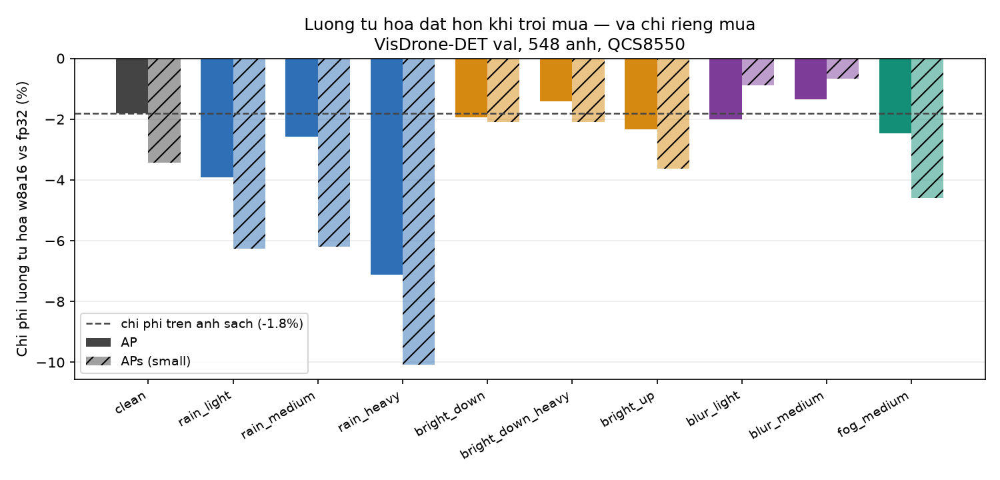

# Quantization on the Hexagon NPU

**Read the provenance line on every table before quoting it.** Numbers in this
document come from three different places, and an earlier version of this file
claimed all of them were "a real QCS8550, not a proxy estimate". That was
wrong, and the correction is worth more than the sentence it replaces: the
proxy and the board disagree by roughly 8×, which section 7 is about.

| Where | What it is | Measures | Used for |
|---|---|---|---|
| **AI Hub `QCS8550 (Proxy)`** | Real silicon, Hexagon V73, `chipset:qualcomm-qcs8550-proxy`, Android 12, in Qualcomm's cloud device farm. Not a simulator — but **not our board** either: AI Hub serves the QCS8550 chipset through an equivalent-SoC device. | NPU latency, op residency, memory | §2 |
| **Our QCS8550 board** | `172.18.50.11:5555`, `product:kalama`, Android 13, QNN v2.45. Physically on the desk. | end-to-end NPU latency, on-device correctness | §5, §7 |
| **Host, ONNX Runtime CPU** | This laptop, running the QDQ ONNX that AI Hub's quantize job produced. Simulates quantized arithmetic; standard practice for accuracy, and *not* a device measurement. | AP / APs, head-output inspection | §3, §4, §6 |

So: **the accuracy story is simulated on the host, the latency story is
on-device, and only the w8a8 failure is confirmed in both places** — which is
the one that matters most, and §7.1 is where it is confirmed on our own board.

Job IDs are recorded so each AI Hub row can be reopened; the board rows carry
the artefact and the harness that produced them.

---

## 1. The pipeline that produced these numbers

```
best.pt ─► ONNX (opset 13, static 1x3x640x640, NMS outside the graph)
        ─► AI Hub quantize job  (64 calibration images, clean, seed 0)
        ─► AI Hub compile job   (--target_runtime qnn_context_binary)
        ─► AI Hub profile job   (real QCS8550)
```

| Stage | Job | Result |
|---|---|---|
| compile fp16 | `j5w4kzomg` | success |
| profile fp16 | `jg9dr2vm5` | 5087 µs |
| quantize w8a8 | `jp1691ln5` | success |
| compile w8a8 | `jp81nrvq5` | success |
| profile w8a8 | `jprwrdjk5` | 1993 µs |
| quantize w8a16 | `j579m82qg` | success |
| profile w8a16 | `j579m8lqg` | 3977 µs |

Calibration set: 64 images sampled across VisDrone-DET-train with seed 0,
preprocessed by importing the pipeline's own `letterbox` so the calibration
distribution is byte-identical to what the deployed model sees
(`np.array_equal` verified). SHA-256 `d80e49589bd7ea0a`.

---

## 2. Latency and residency — AI Hub proxy device

| Precision | Inference | vs fp16 | Ops on NPU | Fallback | Peak memory |
|---|---:|---:|---|---:|---:|
| fp16 | 5.087 ms | 1.00× | 246 / 246 | **0** | 106.1 MB |
| w8a16 | 3.977 ms | 1.28× | 248 / 248 | **0** | 100.4 MB |
| w8a8 | **1.993 ms** | **2.55×** | 248 / 248 | **0** | 101.0 MB |

Zero operator fallback in every configuration: the whole graph lands on the
Hexagon, which is the thing a FLOPs table can never tell you and the reason
`n_ops_fallback` is a column here.

Then the accuracy check turns the table upside down.

---

## 3. w8a8 destroys the classification head

*(Host, ONNX Runtime, on AI Hub's QDQ output. Reproduced on the board in §7.1.)*

The w8a8 model produces **zero detections**. Not fewer — none, on every
image tried.

The failure is specific, and that specificity is what makes it diagnosable
rather than a mystery. Feeding one frame through all three graphs and reading
the raw head output before any decoding:

| | box coordinates | class scores | scores > 0.25 |
|---|---|---|---:|
| fp32 | 0.23 – 638.0 | 0 – 0.9169 | 335 |
| **w8a8** | 0.00 – 637.4 | 0 – **0.00000** | **0** |
| w8a16 | — | 0 – 0.9240 | 338 |

Same tensor shape `(1, 14, 8400)`, same layout, same output name. The box
regression branch survives quantization intact; the classification branch
collapses to exactly zero. So this is not a decoding bug on our side — the
graph itself emits zeros.

Why the two branches differ: box regression outputs coordinates spread over
0–640, a range int8 represents comfortably. The classification branch is a
sigmoid whose output is near zero almost everywhere, with a handful of sharp
peaks. Per-tensor int8 activation quantization fits one scale to that
distribution and the peaks do not survive it.

This matches an independent report of YOLO26 INT8 on RK3588 detecting nothing
while FP16 worked, and a Hailo-8L case study showing disproportionate INT8
degradation. It is a property of the head, not of one vendor's toolchain.

## 4. w8a16 recovers it completely

Widening activations to int16 while keeping int8 weights restores the head:
peak score 0.9240 against fp32's 0.9169, and 338 detections against 335.

**The deployable conclusion inverts the headline speedup.** The fastest
precision is unusable, so the real choice is fp16 → w8a16, and that buys
**1.28×**, not the 2.55× the w8a8 row advertises. A quantization table that
reports latency without checking that the model still detects anything would
have recommended exactly the wrong configuration.

---

## 5. Why the on-device number was 9× worse

Running `qnn-net-run` directly on the board against a YOLOv8n DLC left there
by a previous user gave **47.99 ms**. The same architecture compiled properly
through AI Hub runs in **5.087 ms** — 9.4× apart.

The cause is visible in that run's own output: `init` took 1187 ms, so the
graph was being prepared at load time rather than loaded as a finished HTP
context binary. A DLC is a portable container; a context binary is the
already-compiled-for-this-chip artefact. Shipping the former and measuring it
as if it were the latter understates the hardware by nearly an order of
magnitude.

Both numbers are real. They measure different things, and the report says
which is which.

---

## 6. Quantization costs more in the rain — and only in the rain

*(Host, ONNX Runtime, on AI Hub's w8a16 QDQ output — accuracy, not latency.)*

Every published quantization table this project could find measures accuracy
loss on clean imagery. A drone does not fly in clean imagery. Running the same
ten-condition protocol on the w8a16 model and differencing against fp32 asks
whether the clean figure is the figure that matters.

| Condition | AP fp32 | AP w8a16 | Quantization cost | APs cost |
|---|---:|---:|---:|---:|
| `clean` | 0.1714 | 0.1683 | **−1.8 %** | −3.4 % |
| `rain_light` | 0.1402 | 0.1347 | −3.9 % | −6.3 % |
| `rain_medium` | 0.0890 | 0.0867 | −2.6 % | −6.2 % |
| `rain_heavy` | 0.0295 | 0.0274 | **−7.1 %** | **−10.1 %** |
| `bright_down` | 0.1593 | 0.1562 | −1.9 % | −2.1 % |
| `bright_down_heavy` | 0.1480 | 0.1459 | −1.4 % | −2.1 % |
| `bright_up` | 0.1669 | 0.1630 | −2.3 % | −3.6 % |
| `blur_light` | 0.1602 | 0.1570 | −2.0 % | −0.9 % |
| `blur_medium` | 0.1254 | 0.1237 | −1.4 % | **−0.7 %** |
| `fog_medium` | 0.1618 | 0.1578 | −2.5 % | −4.6 % |



**The clean number understates heavy rain by 3.9× on AP and 2.9× on APs.**
Quoting −1.8 % as "the cost of quantization" describes a condition the
aircraft is not in.

The sharper result is that the amplification is **specific to rain**.
Exposure sits at the clean cost. Fog is barely above it. Blur is *below* it —
`blur_medium` loses only 0.7 % of APs to quantization against clean's 3.4 %.

A mechanism that fits all three: rain *adds* high-frequency structure, which
manufactures detections near the confidence boundary, and quantization noise
flips exactly those. Blur *removes* high-frequency detail, leaving fewer
marginal candidates for quantization to disturb — which is why it is the one
condition where quantization hurts less than on clean data. Exposure changes
are close to monotone per pixel and move the boundary population hardly at
all.

Practical consequence: on a platform that must fly in rain, the deployment
choice is not "w8a16 costs 1.8 %". It is "w8a16 costs 1.8 % on a good day and
7 % on a bad one, in exactly the conditions where 7 % is least affordable".

**Caveat, stated because the percentage invites over-reading.** At
`rain_heavy` the absolute AP is small (0.0295 → 0.0274), so a 7.1 % relative
change is an absolute change of 0.0021. Percentages on a small base are
fragile. The *direction* is consistent across all three rain severities and
across both AP and APs, and the contrast with blur is large; the exact
multiple is not the claim, the ordering is.

---

## 7. The same binaries, run on our own board

Everything above rests on a device we do not own. So the two compiled context
binaries were pulled out of the AI Hub compile jobs and pushed to the board:

```
adb push fp16.bin w8a8.bin /data/local/tmp/sky/ctx/
qnn-net-run --retrieve_context fp16.bin --backend libQnnHtp.so ...
```

Same artefact, same bytes, different silicon. Two things came out of it — one
that confirms the headline finding and one that contradicts a number.

### 7.1 The w8a8 collapse is real on our hardware

Feeding one VisDrone frame through each binary on the board and reading the
raw `(1, 14, 8400)` head output:

| | box coordinates | class scores | scores > 0.25 |
|---|---|---|---:|
| fp32, host ONNX Runtime | 0.26 – 637.98 | 0 – 0.86561 | 137 |
| **fp16, on the board** | 0.25 – 638.00 | 0 – 0.85889 | **135** |
| **w8a8, on the board** | 0.00 – 637.39 | 0 – **0.00000** | **0** |

The fp16 graph running on the board's Hexagon agrees with the host fp32 model
to a class-score correlation of **0.9997**. The w8a8 graph emits exactly zero
class scores on our board, exactly as it did on the proxy. So the central
result of this document — *the fastest precision is the unusable one* — is not
an artefact of Qualcomm's device farm. It reproduces on the hardware we ship on.

### 7.2 The latency does *not* transfer, and the gap is not thermal

| Precision | AI Hub proxy | Our board (median of 5) | Ratio |
|---|---:|---:|---:|
| fp16 | 5.087 ms | **39.84 ms** | 7.8× |
| w8a8 | 1.993 ms | **21.18 ms** | 10.6× |

Timing method: run the same binary with 5 and with 105 inferences and
difference them, so process spawn, backend load, context deserialisation and
graph finalisation all cancel (`4-bench/bench_ctx_device.sh`). The fixed cost
that cancels is ~530 ms, against a ~40 ms inference — which is why a single
`time qnn-net-run` is 93 % overhead and why this is differenced rather than
timed directly.

Four explanations were tested and eliminated:

| Hypothesis | Test | Result |
|---|---|---|
| Thermal throttling | NSP thermal zones during the run | 33.7 °C, cpu4 pinned at 2803/2803 MHz — **not throttled** |
| Another workload | `top`, `loadavg` | 569 % of 600 % idle, load 0.67 — **idle** |
| NPU clock policy | swept `--perf_profile` over `default`, `balanced`, `high_performance`, `sustained_high_performance`, `burst` | 38.7 / 39.1 / 39.4 / 38.9 / 38.1 ms — **flat**, so the NPU clock is not the limiter |
| Host-side dtype conversion | re-ran with `--use_native_input_files` and inputs pre-cast to fp16 and uint8 | 40.3 and 21.1 ms — **no change**, so float→native conversion is not the cost |

What survives: the difference is in the *harness*, not the chip. AI Hub's
`estimated_inference_time` is the backend's own graph-execute figure.
`qnn-net-run` is a file-driven reference application that marshals tensors
across the CPU↔DSP boundary through the general RPC path on every iteration.
The board:proxy ratio tracks input tensor size — fp16 carries 2.46 MB per
inference against w8a8's 1.23 MB, and the on-board fp16:w8a8 ratio is 1.88
against the proxy's 2.55, i.e. the board's costs are pulled toward the
bytes-moved ratio of 2.0 rather than the compute ratio.

This is stated as the surviving hypothesis, not a proven one: the backend
profiler log (`--profiling_level basic`) would settle it, but it is a binary
format and `qnn-profile-viewer` is not on this board, and guessing at its byte
layout is exactly how the three earlier timing errors on this board happened.

**The engineering consequence is the useful part.** Whichever mechanism it is,
a deployed pipeline that hands frames to the NPU the way `qnn-net-run` does
will see ~40 ms, not ~5 ms — the NPU speedup is invisible unless the
application uses shared/ION buffers and keeps tensors resident. For the frame
budget, **39.84 ms is the number to plan against**, and 5.087 ms is the ceiling
that a zero-copy integration would be chasing.

Raw rows: `docs/results/onboard_qcs8550.csv`.

---

## 8. What still needs stating with each row

- `estimated_inference_time` from AI Hub is **compute only** — no camera
  capture, no letterbox, no NMS, no tracking. The frame-budget table is the
  end-to-end figure.
- The board exposes **no usable energy counter**: under a known load the
  battery rail moves 4 mW against 26 mW of idle noise. No watt figures are
  quoted anywhere; thermal is the proxy, and it does respond (42 °C after a
  benchmark, 35 °C at rest).
- Calibration used **clean images only**, which is standard practice and also
  the thing worth questioning — see the degradation cross-table.
