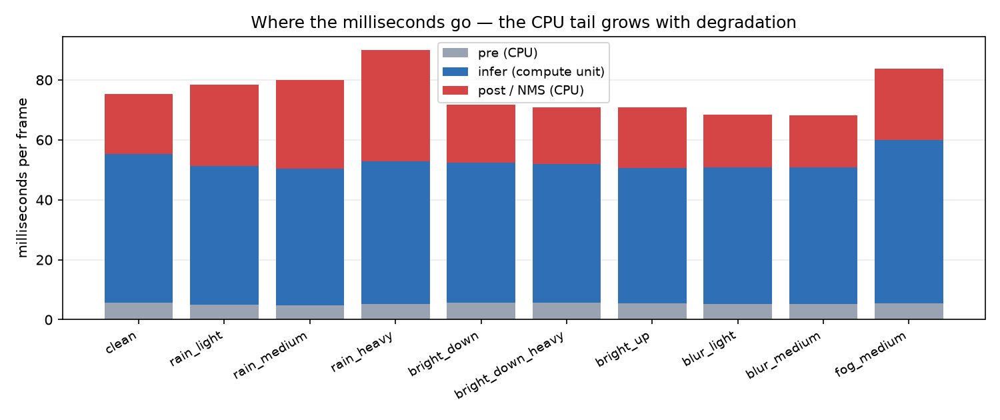
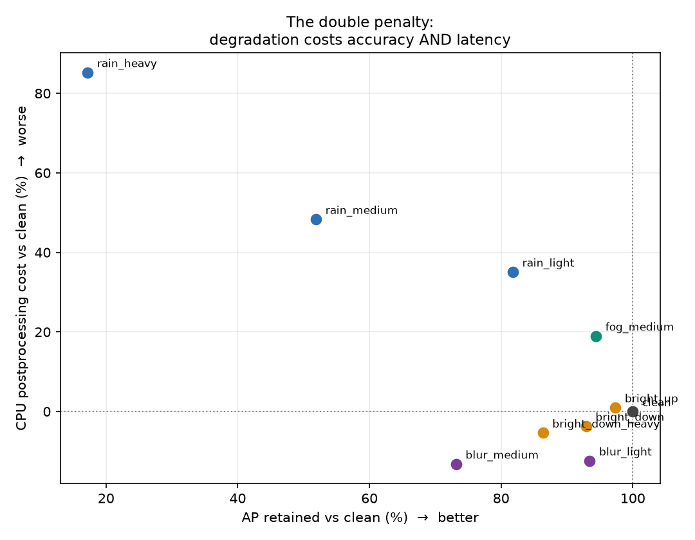

# SkySentry benchmark report

- model: `yolov8n_visdrone_640.onnx` (sha256 `7d7d717d8fcf7bc0`)
- backend: `onnxruntime-cpu`, imgsz 640
- eval set: VisDrone-DET val, 548 images, 10 classes
- ignore-region policy: `mask`
- conf 0.001, IoU 0.65

## 1. Robustness under degraded capture

| condition | AP | AP50 | APs | AP kept | APs kept | det/img | post ms | Δ post |
| --- | ---: | ---: | ---: | ---: | ---: | ---: | ---: | ---: |
| `clean` | 0.1714 | 0.3008 | 0.0756 | 100% | 100% | 255 | 20.0 | +0% |
| `rain_light` | 0.1402 | 0.2495 | 0.0591 | 82% | 78% | 273 | 27.1 | +35% |
| `rain_medium` | 0.0890 | 0.1669 | 0.0387 | 52% | 51% | 278 | 29.7 | +48% |
| `rain_heavy` | 0.0295 | 0.0634 | 0.0149 | 17% | 20% | 280 | 37.1 | +85% |
| `bright_down` | 0.1593 | 0.2785 | 0.0672 | 93% | 89% | 255 | 19.3 | -4% |
| `bright_down_heavy` | 0.1480 | 0.2589 | 0.0621 | 86% | 82% | 256 | 19.0 | -5% |
| `bright_up` | 0.1669 | 0.2949 | 0.0746 | 97% | 99% | 258 | 20.2 | +1% |
| `blur_light` | 0.1602 | 0.2794 | 0.0674 | 93% | 89% | 250 | 17.5 | -12% |
| `blur_medium` | 0.1254 | 0.2230 | 0.0450 | 73% | 60% | 254 | 17.4 | -13% |
| `fog_medium` | 0.1618 | 0.2853 | 0.0719 | 94% | 95% | 261 | 23.8 | +19% |

## 2. Latency split

`infer` is the compute unit; `pre` and `post` are always CPU. They are
reported separately because they scale with different things — `infer`
with resolution, `post` with scene density.

| condition | pre | infer | post | total ms | FPS |
| --- | ---: | ---: | ---: | ---: | ---: |
| `clean` | 5.8 | 49.5 | 20.0 | 75.3 | 13.3 |
| `rain_light` | 4.9 | 46.4 | 27.1 | 78.4 | 12.8 |
| `rain_medium` | 4.9 | 45.5 | 29.7 | 80.1 | 12.5 |
| `rain_heavy` | 5.3 | 47.7 | 37.1 | 90.1 | 11.1 |
| `bright_down` | 5.7 | 46.7 | 19.3 | 71.8 | 13.9 |
| `bright_down_heavy` | 5.6 | 46.3 | 19.0 | 70.8 | 14.1 |
| `bright_up` | 5.3 | 45.2 | 20.2 | 70.8 | 14.1 |
| `blur_light` | 5.3 | 45.6 | 17.5 | 68.5 | 14.6 |
| `blur_medium` | 5.3 | 45.4 | 17.4 | 68.1 | 14.7 |
| `fog_medium` | 5.4 | 54.5 | 23.8 | 83.8 | 11.9 |

## 3. Degradation cost — and why it flips with the threshold

At the AP-measurement threshold (conf 0.001) degradation
can create spurious candidates that survive scoring, so NMS on the CPU
has more boxes to process and postprocessing gets *slower*. At a
deployment threshold the effect can reverse: degradation pushes
confidences below the bar, fewer boxes reach NMS, and the pipeline gets
**faster because it sees less**.

That second case is the more dangerous one operationally — latency
telemetry looks healthy at exactly the moment the detector is going
blind, and since the vehicle count falls too, a congestion monitor
reads 'normal' when the truth is 'cannot see'.

Any claim about the latency cost of degradation must state the
confidence threshold it was measured at **and the model it was measured
on** — this report covers `yolov8n_visdrone_640.onnx` only. Deployment-threshold
figures come from a separate run of
`scripts/make_comparison_video.py`, which writes its own CSV.

> **Latency columns in this run are not reliable.** `infer_ms` is a
> fixed-shape forward pass — identical work on every frame — yet it
> varies **20%** across conditions here (worst: `fog_medium`).
> That is host load or thermal state, not the data, and the same
> noise contaminates the `post_ms` deltas beside it. Quote the AP
> columns, which are deterministic; re-measure latency on an idle
> machine, or better, on the target device.

## 4. Per-class AP on clean data

| class | AP (clean) |
| --- | ---: |
| car | 0.4916 |
| bus | 0.2808 |
| van | 0.2073 |
| truck | 0.1889 |
| motor | 0.1413 |
| pedestrian | 0.1396 |
| tricycle | 0.1059 |
| people | 0.0815 |
| awning-tricycle | 0.0517 |
| bicycle | 0.0254 |

## 5. Latency ladder (synthetic load)

| backend | imgsz | candidates | infer ms | post ms | total ms | FPS |
| --- | ---: | ---: | ---: | ---: | ---: | ---: |
| `onnxruntime-cpu` | 640 | 50 | 47.95 | 1.92 | 49.87 | 20.1 |
| `onnxruntime-cpu` | 640 | 150 | 47.95 | 4.21 | 52.16 | 19.2 |
| `onnxruntime-cpu` | 640 | 300 | 47.95 | 9.01 | 56.97 | 17.6 |
| `onnxruntime-cpu` | 640 | 600 | 47.95 | 19.82 | 67.78 | 14.8 |
